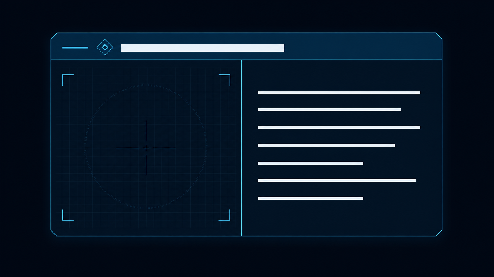

# Scene2 元件介绍 UI 卡片 Photoshop 切图指南

## 1. 文档目的

本文用于把已经确认的元件介绍卡片概念稿整理为可在 Unity 2022.3 uGUI 中复用的 UI 图片资产。

卡片目标规格：

- Unity 当前落地尺寸：`520 × 272 px`
- 使用场景：Scene2 元件介绍悬浮卡片
- 视觉风格：深蓝半透明底、青蓝描边、冷白文字、轻度切角 HUD
- 中文字体：项目已有的 `SIMHEI SDF`
- 制作原则：Photoshop 只制作 Unity 不方便稳定绘制的形状；文字、分隔线、十字线、阴影和布局在 Unity 中完成

概念图只能作为视觉参考，不应整张裁切后直接作为最终卡片。整图直接使用会导致文字无法替换、缩放后模糊、不同元件无法共用，并妨碍后续悬停交互。



### 1.1 当前 Prefab 实际采用的交付切图

本次 Prefab Lab 已按用户交付的 1～6 号切图导入，使用固定比例分层复刻；第 7 张问题图未进入 Unity 工程。

| 原编号 | Unity 文件名 | 实际用途 | 处理说明 |
|---:|---|---|---|
| 1 | `ComponentInfoCard_Base.png` | 卡片底板、外框和内容分隔线 | 固定尺寸显示，整体 Alpha 在 Unity 中设为 85% |
| 2 | `ComponentInfoCard_CornerBracket.png` | 左侧展示区四角定位括号 | 同一 Sprite 旋转复用四次 |
| 3 | `ComponentInfoCard_Crosshair.png` | 中心十字瞄准线 | 原图网格像素 Alpha 为 0，因此只使用可见准星部分 |
| 4 | `ComponentInfoCard_Header.png` | 顶部贯穿标题栏 | 固定尺寸覆盖在底板标题区 |
| 5 | `ComponentInfoCard_Locator.png` | 标题栏菱形定位标记 | 原尺寸等比缩放使用 |
| 6 | `ComponentInfoCard_ScanRing.png` | 左侧低对比度扫描环 | 保留透明通道，低对比度显示 |
| 7 | 不导入 | 问题合成图 | 与底板内容重复且不利于分层复刻，明确弃用 |

网格由 `ComponentInfoGridGraphic` 在 Unity 中以 `10.4 px` 间距、`0.8 px` 线宽和 `#40DBFF14` 绘制，用于替代第 3 张切图中不可见的网格部分。当前 Prefab 依据原稿 `1328 × 694` 的比例缩放为 `520 × 272`，约为 `0.3917` 倍；这一版本不使用九宫格，也不支持改变卡片宽高比。

---

## 2. 通用重新切图建议

如果未来需要让卡片自由改变尺寸或主题颜色，建议按下面的方案重新制作 7 张透明 PNG。填充形状全部使用白色遮罩，在 Unity 中通过 `Image.color` 着色，避免把主题颜色固化在图片中。以下是扩展性方案，不是本次 Prefab 的实际导入清单。

| 文件名 | PSD 画板尺寸 | 用途 | Unity 显示方式 | 是否九宫格 |
|---|---:|---|---|---|
| `ComponentInfoCard_Background_9Sliced.png` | 128 × 128 | 卡片切角背景遮罩 | `Image`，着色为深海军蓝 | 是，Border 24 |
| `ComponentInfoCard_Outline_9Sliced.png` | 128 × 128 | 卡片青蓝外描边 | `Image`，着色为青蓝 | 是，Border 24 |
| `ComponentInfoCard_Header_9Sliced.png` | 128 × 64 | 顶部贯穿标题栏遮罩 | `Image`，着色为深蓝青 | 是，Border 24 |
| `ComponentInfoCard_Locator.png` | 48 × 48 | 标题栏菱形定位装饰 | `Image`，着色为青蓝 | 否 |
| `ComponentInfoCard_CornerBracket.png` | 64 × 64 | 展示区四角定位括号 | 同一 Sprite 旋转复用 | 否 |
| `ComponentInfoCard_ScanRing.png` | 256 × 256 | 展示区淡扫描圆环 | `Image`，低透明度青蓝 | 否 |
| `ComponentInfoCard_GridTile.png` | 32 × 32 | 展示区背景网格 | `Image Type = Tiled` | 否 |

### 2.1 不需要切图的内容

以下内容应直接在 Unity 中制作：

- 标题文字和描述文字：使用 TextMesh Pro
- 标题栏左侧短横线：使用纯色 `Image`
- 左右区域分隔线：使用宽度 `1–2 px` 的 `Image`
- 中心十字瞄准线：使用两个细长 `Image`
- 卡片阴影：复用背景九宫格图片，向右下偏移并着色为半透明黑色
- 元件预览图：后续使用独立透明 PNG、Sprite 或 `RawImage + RenderTexture`
- 概念稿中的白色标题/正文占位线：不得作为最终切图保留

---

## 3. 颜色与尺寸规范

### 3.1 Unity 最终色值

由于 Photoshop 输出的是白色遮罩，下列颜色在 Unity Inspector 中设置：

| 元素 | 十六进制颜色 | 说明 |
|---|---|---|
| 卡片背景 | `#081A29D9` | 约 85% 不透明度 |
| 标题栏 | `#0A2E42F5` | 约 96% 不透明度 |
| 青蓝强调 | `#40DBFFF2` | 外框、分隔线、定位装饰 |
| 主文字 | `#EAF7FFFF` | 元件名称 |
| 正文 | `#EAF7FFDC` | 描述文字 |
| 网格 | `#40DBFF14` | 约 8% 不透明度 |
| 扫描环 | `#40DBFF1F` | 约 12% 不透明度 |
| 阴影 | `#00000040` | 约 25% 不透明度 |

### 3.2 卡片布局参考值

| 项目 | 数值 |
|---|---:|
| 卡片尺寸 | 520 × 272 |
| 标题栏高度 | 52 |
| 下方内容高度 | 288 |
| 左侧展示区宽度 | 264（卡片宽度的 44%） |
| 中间分隔线宽度 | 1–2 |
| 标题栏左右内边距 | 20 |
| 正文区域内边距 | 22 |
| 标题字号 | 22–24 |
| 正文字号 | 16–18 |
| 正文行距 | 1.3–1.5 |

---

## 4. Photoshop 主文件设置

### 4.1 新建 PSD

1. 打开 Photoshop，选择 `文件 > 新建`。
2. 创建 `1536 × 864 px`、RGB、8 位、sRGB 的文档。
3. 文件名保存为 `Scene2_ComponentInfoCard_UI_Slices.psd`。
4. 在 `视图` 菜单中开启：
   - `对齐`
   - `对齐到 > 图层`
   - `对齐到 > 文档边界`
   - `显示 > 智能参考线`
5. 在首选项中确保形状工具使用像素对齐，避免水平和垂直细线落在半像素上。

### 4.2 放置概念图作为参考

1. 选择 `文件 > 置入嵌入对象`，放入元件介绍卡片概念图。
2. 将图层命名为 `REFERENCE_ONLY`。
3. 将不透明度降低到 `30%–40%`。
4. 锁定该图层。
5. 不要从概念图中直接魔棒抠图或复制像素；所有正式资产必须使用形状图层重新绘制。

### 4.3 创建画板

使用画板工具创建以下 7 个画板，并直接使用最终文件名作为画板名称：

```text
ComponentInfoCard_Background_9Sliced     128 × 128
ComponentInfoCard_Outline_9Sliced        128 × 128
ComponentInfoCard_Header_9Sliced         128 × 64
ComponentInfoCard_Locator                 48 × 48
ComponentInfoCard_CornerBracket           64 × 64
ComponentInfoCard_ScanRing               256 × 256
ComponentInfoCard_GridTile                32 × 32
```

每个画板必须保持透明背景，不创建白色或黑色底层。

---

## 5. 各资产的具体制作方法

## 5.1 卡片背景遮罩

目标文件：`ComponentInfoCard_Background_9Sliced.png`

1. 进入 `128 × 128` 的背景画板。
2. 选择钢笔工具，模式设为 `形状`。
3. 按顺序输入或对齐以下顶点，形成四角切角矩形：

```text
(16, 0)
(112, 0)
(128, 16)
(128, 112)
(112, 128)
(16, 128)
(0, 112)
(0, 16)
```

4. 闭合路径。
5. 填充设为纯白 `#FFFFFF`，描边设为无。
6. 图层不透明度保持 `100%`。
7. 放大到 800% 检查：四个透明切角必须完全一致，水平和垂直边不得出现半透明毛边。

该图片只提供形状和透明区域。最终的 `#081A29D9` 颜色在 Unity 中设置。

## 5.2 卡片外描边

目标文件：`ComponentInfoCard_Outline_9Sliced.png`

1. 复制背景遮罩的矢量形状到描边画板，并确保位置完全一致。
2. 将填充设为无。
3. 将描边设为纯白 `#FFFFFF`。
4. 描边宽度设置为 `2 px`。
5. 描边位置设置为 `内部`。
6. 图层不透明度保持 `100%`。
7. 检查四个切角连接处，不能出现断线、圆角或线宽变化。

Unity 中使用青蓝色 `#40DBFFF2` 着色。背景和描边分开后，可以单独调整描边亮度，而不影响卡片透明度。

## 5.3 标题栏背景遮罩

目标文件：`ComponentInfoCard_Header_9Sliced.png`

1. 进入 `128 × 64` 标题栏画板。
2. 使用钢笔工具创建只有顶部两角切角、底部保持直角的形状：

```text
(16, 0)
(112, 0)
(128, 16)
(128, 64)
(0, 64)
(0, 16)
```

3. 填充纯白，关闭描边。
4. 不要在 PNG 中绘制底部分隔线；分隔线在 Unity 中用独立 `Image` 制作，便于调节粗细和透明度。
5. 检查标题栏的顶部切角与卡片背景切角角度一致。

Unity 中将该图片着色为 `#0A2E42F5`。

## 5.4 标题栏定位图形

目标文件：`ComponentInfoCard_Locator.png`

1. 进入 `48 × 48` 透明画板。
2. 使用矩形工具创建一个 `22 × 22 px` 的正方形形状。
3. 取消填充，设置 `2 px` 白色内部描边。
4. 将正方形旋转 `45°`，并在画板中水平、垂直居中。
5. 再创建一个 `8 × 8 px` 的小正方形，同样旋转 `45°` 并居中。
6. 小正方形可以使用白色填充，也可以使用 `2 px` 白色描边；整套资产只能选择一种做法并保持一致。
7. 保证图形四周至少留出 `8 px` 透明空间。

Unity 中将该图片着色为青蓝色。若希望更克制，可将最终 Image Alpha 调至 `70%–85%`。

## 5.5 展示区四角定位括号

目标文件：`ComponentInfoCard_CornerBracket.png`

只制作左上角版本，Unity 中通过旋转复用其余三个方向。

1. 进入 `64 × 64` 透明画板。
2. 创建一条 `28 × 2 px` 的白色横线，左上位置设为 `(12, 12)`。
3. 创建一条 `2 × 28 px` 的白色竖线，左上位置同样设为 `(12, 12)`。
4. 两条线应无缝组成 `L` 形，禁止使用外发光或投影。
5. 合并到同一组，但保留形状图层，方便后续修改线宽。

Unity 中的旋转值：

| 位置 | Z 轴旋转 |
|---|---:|
| 左上 | 0° |
| 右上 | -90° |
| 右下 | 180° |
| 左下 | 90° |

## 5.6 扫描圆环

目标文件：`ComponentInfoCard_ScanRing.png`

1. 进入 `256 × 256` 透明画板。
2. 选择椭圆工具，按住 Shift 创建 `216 × 216 px` 的正圆。
3. 将圆环水平、垂直居中，使四周留出 `20 px` 空间。
4. 关闭填充，使用 `2 px` 白色描边。
5. 在描边选项中设置虚线：建议短划线 `2 px`、间隔 `6 px`。
6. 如果 Photoshop 版本无法稳定生成均匀虚线，使用连续圆环即可，不要手工复制大量刻度。
7. PNG 本身保持白色和 100% 不透明；低透明度在 Unity 中设置。

Unity 中使用 `#40DBFF1F`，不要在 Photoshop 中添加模糊或强发光。

## 5.7 网格平铺单元

目标文件：`ComponentInfoCard_GridTile.png`

1. 进入 `32 × 32` 透明画板。
2. 在 `X = 0` 处绘制一条 `1 × 32 px` 白色竖线。
3. 在 `Y = 0` 处绘制一条 `32 × 1 px` 白色横线。
4. 不要同时在 `X = 31` 或 `Y = 31` 再画线，否则平铺后会出现双线。
5. 使用 `滤镜 > 其他 > 位移`，水平和垂直各偏移 `16 px`，临时检查接缝是否连续；确认后撤销位移，保留原始顶边和左边线版本。
6. 禁止添加噪点、渐变、发光和背景色。

Unity 中用 `#40DBFF14` 着色，并将 `Image Type` 设为 `Tiled`。

---

## 6. Photoshop 导出方法

### 6.1 导出前检查

逐个画板确认：

- 画板背景为透明棋盘格
- 没有残留的参考图像素
- 没有文字、数字、Logo 或白色背景
- 图形严格位于整数像素坐标
- 同类线条宽度一致
- 画板名称与最终文件名一致

### 6.2 导出 PNG

1. 选择 `文件 > 导出 > 导出为`。
2. 选中全部 7 个画板。
3. 格式选择 `PNG`。
4. 开启 `透明度`。
5. 缩放保持 `100%`。
6. 色彩空间选择 `转换为 sRGB`。
7. 不进行二次缩放，不导出 `@2x` 或 `@3x` 版本。
8. 输出到 Unity 项目的以下目录：

```text
ElectroOptic-Lab/Assets/Arts/UI/ComponentInfoCard/
```

如果该目录尚不存在，应先在 Unity Project 窗口中创建，保证 `.meta` 文件由 Unity 正常生成。

---

## 7. Unity 导入设置

### 7.1 通用设置

选中所有 PNG，设置：

| 选项 | 值 |
|---|---|
| Texture Type | Sprite (2D and UI) |
| Sprite Mode | Single |
| Pixels Per Unit | 100 |
| Mesh Type | Full Rect |
| Generate Mip Maps | Off |
| Alpha Is Transparency | On |
| Filter Mode | Bilinear |
| Compression | None |
| Max Size | 256 或以上 |

点击 `Apply`。

### 7.2 九宫格设置

对以下三个 Sprite 打开 Sprite Editor：

```text
ComponentInfoCard_Background_9Sliced.png
ComponentInfoCard_Outline_9Sliced.png
ComponentInfoCard_Header_9Sliced.png
```

统一设置 Border：

```text
Left   = 24
Right  = 24
Top    = 24
Bottom = 24
```

保存后，在对应 uGUI `Image` 组件中设置：

```text
Image Type = Sliced
Fill Center = On
Pixels Per Unit Multiplier = 1
```

描边图片也保留 `Fill Center = On`；因为描边 Sprite 中心本身透明，不会覆盖背景。

### 7.3 网格设置

对 `ComponentInfoCard_GridTile.png` 设置：

```text
Wrap Mode = Repeat
Image Type = Tiled
```

如果网格在某些缩放比例下变模糊，应优先把卡片保持在整数缩放和整数坐标，不要把 Filter Mode 改为 Point，以免斜线和圆环出现锯齿。

---

## 8. Unity Prefab 组装参考

建议层级：

```text
ComponentInfoCard                         RectTransform 520 × 272
├── Shadow                               复用 Background Sprite
├── CardBackground                       Background_9Sliced
├── CardOutline                          Outline_9Sliced
├── Header                               Header_9Sliced，高 52
│   ├── AccentLine                       普通 Image
│   ├── LocatorMark                      Locator Sprite
│   └── TitleText                        TextMeshProUGUI
└── Content                              顶部偏移 52
    ├── ShowcaseArea                     宽 264
    │   ├── Grid                         GridTile，Tiled
    │   ├── ScanRing                     ScanRing Sprite
    │   ├── CornerBracket_LT             CornerBracket Sprite
    │   ├── CornerBracket_RT             旋转 -90°
    │   ├── CornerBracket_RB             旋转 180°
    │   ├── CornerBracket_LB             旋转 90°
    │   ├── CrosshairHorizontal          普通 Image
    │   ├── CrosshairVertical            普通 Image
    │   └── ComponentPreview             Image 或 RawImage
    ├── Divider                          普通 Image，宽 1–2
    └── DescriptionText                  TextMeshProUGUI
```

### 8.1 关键组件设置

- `ComponentInfoCard` 增加 `CanvasGroup`，为后续悬停淡入淡出预留。
- 背景、描边、网格、圆环和所有装饰 Image 的 `Raycast Target` 全部关闭。
- 标题和正文使用 `SIMHEI SDF`，不要使用无 CJK 字形的 LiberationSans。
- `TitleText` 使用主文字色 `#EAF7FFFF`。
- `DescriptionText` 使用正文色 `#EAF7FFDC`，开启自动换行。
- 概念图的占位横线在 Prefab 中由真实 TMP 文本替代。
- `ComponentPreview` 第一版优先使用透明背景 Sprite；需要实时 3D 预览时再替换为 `RawImage + RenderTexture`。

---

## 9. 验收检查表

### 9.1 Photoshop 资产验收

- [ ] 共导出 7 张 PNG，文件名与本文一致
- [ ] 所有 PNG 背景透明
- [ ] 背景与描边为两个独立 Sprite
- [ ] 卡片和标题栏切角角度一致
- [ ] 网格平铺无双线、断线和明显接缝
- [ ] 圆环居中且无模糊光晕
- [ ] 四角括号只制作一张并可正常旋转复用
- [ ] 未把标题、正文或元件图片固化进切图

### 9.2 Unity 资产验收

- [ ] 卡片在 `520 × 272` 下切角和描边无拉伸
- [ ] 卡片缩放到 80% 和 120% 时，九宫格边缘仍正常
- [ ] 标题栏完整贯穿卡片顶部
- [ ] 左侧展示区宽度约占 44%
- [ ] 网格、圆环和定位括号保持低对比度，不抢夺元件主体
- [ ] 中文标题和正文无缺字、乱码和溢出
- [ ] 所有装饰 Image 均不拦截 UI 射线
- [ ] 在 Scene2 明暗不同的背景区域上仍能清晰阅读
- [ ] Prefab 中可独立替换元件名称、描述和预览图

---

## 10. 常见问题

### 10.1 九宫格后切角变形

原因通常是 Sprite Border 小于切角尺寸，或 `Image Type` 仍为 `Simple`。确认 Border 四边均为 `24`，Image Type 为 `Sliced`。

### 10.2 卡片顶部切角被标题栏盖住

标题栏必须使用带顶部切角的 `ComponentInfoCard_Header_9Sliced.png`，不能使用普通矩形 Image。标题栏 RectTransform 应与卡片顶部边缘对齐。

### 10.3 透明底在 Unity 中出现白边

确认 `Alpha Is Transparency` 已开启、Compression 为 None，并检查 Photoshop 图层是否添加了白色外发光。切图资产不应包含外发光。

### 10.4 网格过亮或产生摩尔纹

先降低 Unity 中 Grid Image 的 Alpha，不要直接模糊 PNG。推荐使用 `#40DBFF14`；卡片缩放时尽量保持整数比例和整数坐标。

### 10.5 圆环或斜切角出现锯齿

确认 Photoshop 中使用矢量形状而非铅笔工具，Unity Filter Mode 使用 Bilinear，并避免对 RectTransform 使用非整数尺寸。

### 10.6 是否可以直接把概念图裁成左右两张图片

不建议。概念图包含固定占位内容、烘焙阴影和背景颜色，裁切后无法灵活更换文字、元件和主题，也无法通过九宫格适配不同尺寸。
