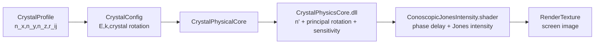

# 电光效应原理展示汇报初稿

> 本文档面向项目理论展示与汇报撰写。写作结构参考“统一理论模型 -> 分类型推导 -> 仿真实现映射 -> 验证思路”的实验报告框架，并结合本项目实际使用的 KDP、LiNbO3、KTP 晶体参数、物理 DLL 和 Unity Shader 渲染链路。

## 第 1 章 绪论与项目目标

电光效应实验的核心目标，是展示外加电场如何改变晶体的光学性质，并进一步改变偏振光的相位、偏振态和干涉图样。传统实验中，这一过程通常通过晶体、偏振片、检偏片和屏幕观察完成；在本项目中，该过程被拆解为可计算、可交互、可渲染的仿真流程。

本项目的理论展示目标包括：

1. 建立折射率椭球与晶体各向异性的对应关系。
2. 说明线性电光效应如何通过电光系数矩阵改变介电不渗透张量。
3. 推导典型晶体在特定外场方向下的主轴旋转与折射率分裂。
4. 将折射率差转化为相位延迟，并解释锥光干涉图样的形成。
5. 给出理论量与 Unity 项目实现变量之间的对应关系。

项目当前涉及三类典型晶体：

| 晶体 | 类型 | 默认波长 | 项目中主要展示点 |
| --- | --- | ---: | --- |
| KDP | 单轴晶体 | 546 nm | $r_{63}$ 导致的主轴旋转与折射率分裂 |
| LiNbO3 | 单轴晶体 | 633 nm | 较强线性电光响应，含 $r_{22},r_{33}$ |
| KTP | 双轴晶体 | 632.8 nm | 双轴锥光干涉与双光轴图样 |

## 第 2 章 电光效应理论与数学建模

### 2.1 折射率椭球与本征偏振

在晶体的介电主轴坐标系中，折射率椭球的一般形式为：

$$
\frac{x^2}{n_x^2}+\frac{y^2}{n_y^2}+\frac{z^2}{n_z^2}=1
$$

其中 $x,y,z$ 是介电主轴方向，$n_x,n_y,n_z$ 是对应的主折射率。该椭球的几何含义是：当一束光沿波矢方向 $\vec{k}$ 传播时，过椭球中心作一个垂直于 $\vec{k}$ 的平面，该平面与折射率椭球相交得到一个椭圆。椭圆的两条主轴方向对应两束允许传播的本征偏振方向，主轴长度对应两束光的相速度折射率。

因此，晶体中的偏振传播问题可以转化为一个几何问题：

1. 确定光传播方向 $\vec{k}$。
2. 求垂直于 $\vec{k}$ 的椭球截面。
3. 从截面椭圆读出两束本征偏振光的方向和折射率。
4. 由折射率差计算相位延迟和干涉强度。

晶体类型可以由主折射率关系判断：

- 各向同性晶体：$n_x=n_y=n_z$，折射率椭球退化为球面。
- 单轴晶体：$n_x=n_y\ne n_z$，折射率椭球为旋转椭球。
- 双轴晶体：$n_x\ne n_y\ne n_z$，折射率椭球为三轴椭球。

### 2.2 介电不渗透张量与 Voigt 记号

电光效应通常不直接写成折射率 $n$ 的变化，而是写成介电不渗透张量，也就是 $1/n^2$ 相关量的变化。令：

$$
\mathbf{B}=
\begin{pmatrix}
B_{11}&B_{12}&B_{13}\\
B_{12}&B_{22}&B_{23}\\
B_{13}&B_{23}&B_{33}
\end{pmatrix}
$$

在无外场的主轴坐标系中：

$$
\mathbf{B}_0=
\begin{pmatrix}
1/n_x^2&0&0\\
0&1/n_y^2&0\\
0&0&1/n_z^2
\end{pmatrix}
$$

对应折射率椭球：

$$
B_{11}x^2+B_{22}y^2+B_{33}z^2
+2B_{12}xy+2B_{13}xz+2B_{23}yz=1
$$

由于 $\mathbf{B}$ 是对称矩阵，只有 6 个独立分量。使用 Voigt 记号：

$$
(B_1,B_2,B_3,B_4,B_5,B_6)
=(B_{11},B_{22},B_{33},B_{23},B_{13},B_{12})
$$

这样可以把电光效应写成便于程序实现的矩阵形式。

### 2.3 线性电光效应模型

对于无反演中心的晶体，外加电场会引起线性电光效应，也称 Pockels 效应。介电不渗透张量的一阶扰动为：

$$
\Delta B_i=\Delta(1/n^2)_i=\sum_{j=1}^{3}r_{ij}E_j,\qquad i=1,\dots,6
$$

矩阵形式为：

$$
\begin{pmatrix}
\Delta B_1\\
\Delta B_2\\
\Delta B_3\\
\Delta B_4\\
\Delta B_5\\
\Delta B_6
\end{pmatrix}
=
\begin{pmatrix}
r_{11}&r_{12}&r_{13}\\
r_{21}&r_{22}&r_{23}\\
r_{31}&r_{32}&r_{33}\\
r_{41}&r_{42}&r_{43}\\
r_{51}&r_{52}&r_{53}\\
r_{61}&r_{62}&r_{63}
\end{pmatrix}
\begin{pmatrix}
E_x\\E_y\\E_z
\end{pmatrix}
$$

其中 $r_{ij}$ 是线性电光系数，单位通常为 m/V 或 pm/V。项目中 `CrystalProfile` 以 pm/V 存储，传入物理 DLL 前统一乘 $10^{-12}$ 转为 m/V。

加电场后的新椭球为：

$$
B'_1x^2+B'_2y^2+B'_3z^2+2B'_4yz+2B'_5xz+2B'_6xy=1
$$

其中：

$$
B'_i=B_{0,i}+\Delta B_i
$$

如果 $B'_4,B'_5,B'_6$ 不为零，就会出现 $yz,xz,xy$ 交叉项。这说明原来的坐标轴不再是扰动后的主轴，需要对 $\mathbf{B}'$ 做对角化，得到新的主折射率和新主轴方向。

### 2.4 相位延迟与 Jones 干涉强度

两束本征偏振光通过厚度为 $L$ 的晶体后，相位差为：

$$
\delta=\frac{2\pi}{\lambda}(n_1-n_2)L
$$

对斜入射光线，项目中使用有效光程修正：

$$
L_{\mathrm{eff}}=\frac{L}{|\cos\theta|}
$$

因此每条光线的相位延迟写为：

$$
\delta=
\frac{2\pi}{\lambda}L_{\mathrm{eff}}|n_1-n_2|
$$

经过偏振片和检偏片后，两个本征方向上的振幅重新投影并发生干涉。项目 Shader 中使用的强度形式可概括为：

$$
I=I_0(a_o^2+a_e^2+2a_oa_e\cos\delta)
$$

其中 $a_o,a_e$ 包含入射偏振方向和检偏方向在两条本征偏振方向上的投影。

### 2.5 半波电压与调制构型

若电致相位延迟达到 $\pi$，对应电压称为半波电压 $V_\pi$。这是评价电光调制效率的重要指标。

纵向调制中，电场方向与光传播方向一致，$E=V/L$，因此晶体长度会在相位延迟表达式中抵消，半波电压主要由波长、折射率和电光系数决定。

横向调制中，电场方向垂直于光传播方向，$E=V/d$。若晶体长度为 $L$，电极间距为 $d$，则半波电压与 $d/L$ 成正比：

$$
V_\pi=
\frac{\lambda}{r_xn_x^3-r_yn_y^3}\frac{d}{L}
$$

因此横向构型可以通过增大作用长度、减小电极间距来降低驱动电压。项目中 `CrystalWorkingGeometry` 对 KTP 和普通晶体分别设置了工作光路、电场方向和调制模式。

## 第 3 章 典型晶体的电光响应推导

### 3.1 KDP 晶体：$r_{63}$ 引起的主轴旋转

KDP 是单轴晶体，可近似写为：

$$
\frac{x^2+y^2}{n_o^2}+\frac{z^2}{n_e^2}=1
$$

其线性电光系数矩阵在常用形式下可写为：

$$
\begin{pmatrix}
0&0&0\\
0&0&0\\
0&0&0\\
r_{41}&0&0\\
0&r_{41}&0\\
0&0&r_{63}
\end{pmatrix}
$$

若外加电场沿 $z$ 轴：

$$
\mathbf{E}=(0,0,E)
$$

则只有：

$$
\Delta B_6=r_{63}E
$$

加场后的椭球为：

$$
\frac{x^2+y^2}{n_o^2}+\frac{z^2}{n_e^2}+2r_{63}Exy=1
$$

该式出现 $xy$ 交叉项，说明新主轴相对原 $x,y$ 轴发生旋转。令：

$$
x=\frac{x'-y'}{\sqrt{2}},\qquad
y=\frac{x'+y'}{\sqrt{2}},\qquad
z=z'
$$

代入整理得：

$$
\left(\frac{1}{n_o^2}+r_{63}E\right)x'^2+
\left(\frac{1}{n_o^2}-r_{63}E\right)y'^2+
\frac{z'^2}{n_e^2}=1
$$

由此可得：

$$
\frac{1}{n_{x'}^2}=\frac{1}{n_o^2}+r_{63}E
$$

$$
\frac{1}{n_{y'}^2}=\frac{1}{n_o^2}-r_{63}E
$$

当电光扰动较小时，用一阶近似：

$$
n_{x'}\approx n_o-\frac{1}{2}n_o^3r_{63}E
$$

$$
n_{y'}\approx n_o+\frac{1}{2}n_o^3r_{63}E
$$

这说明 KDP 中沿 $z$ 方向施加电场会使 $x,y$ 平面中的两个本征折射率分裂，并使主轴旋转 $45^\circ$。该推导是项目解释“电场导致相位差变化”的最直观示例。

### 3.2 LiNbO3 晶体：单轴晶体的强电光响应

LiNbO3 也是项目中的单轴晶体，资源参数为：

$$
n_x=n_y=2.286,\qquad n_z=2.200
$$

项目资源中 LiNbO3 的主要电光系数包括：

$$
r_{22}=-6.8\ \mathrm{pm/V},\qquad r_{33}=30.9\ \mathrm{pm/V}
$$

相较 KDP，LiNbO3 的 $r_{33}$ 较大，适合用于展示较强的电光调制响应。其理论处理方式与 KDP 一致：先根据外加电场方向计算 $\Delta B_i$，再构造扰动后的 $\mathbf{B}'$，最后对角化得到新主折射率和主轴旋转矩阵。

在汇报中，LiNbO3 可作为“同样是单轴晶体，但电光系数不同导致响应强弱不同”的对照材料。建议展示内容包括：

- 无外场时的单轴折射率椭球。
- 加电场后主折射率变化。
- 不同电场强度下相位延迟变化趋势。

### 3.3 KTP 晶体：双轴晶体与锥光干涉

KTP 在项目中作为双轴晶体展示，资源参数为：

$$
n_x=1.763569,\qquad
n_y=1.773327,\qquad
n_z=1.863399
$$

因为三个主折射率互不相等，其折射率椭球为三轴椭球。双轴晶体中存在两个特殊方向：沿这些方向传播时，垂直于波矢的椭球截面为圆，两束本征偏振光折射率相等，因此这两个方向称为光轴。

对于双轴晶体，两个光轴位于最大折射率轴和最小折射率轴构成的平面内。若设 $n_x<n_y<n_z$，则光轴与 $z$ 轴夹角满足：

$$
\tan\vartheta=
\frac{n_z}{n_x}
\sqrt{
\frac{n_y^2-n_x^2}{n_z^2-n_y^2}
}
$$

项目中 KTP 主要用于锥光干涉展示：屏幕上每个像素对应一条不同方向的光线，接近两个光轴方向时，相位延迟和本征偏振方向发生特殊变化，形成双黑点、消光刷和环纹等双轴锥光特征。

KTP 在 `ConoscopicTextureRenderer` 中还提供了教学预设参数：

| 参数 | 值 |
| --- | ---: |
| 波长 | 589.3 nm |
| 晶体厚度 | 0.915 mm |
| 屏幕距离 | 0.7 m |
| 屏幕半尺寸 | 0.08 m |
| 晶轴面内角 | 45° |

这些预设用于稳定呈现双轴锥光图样，便于教学展示。

## 第 4 章 Unity 仿真实现映射

### 4.1 理论计算链路

项目中完整计算链路如下：

### 4.2 理论量与项目变量对应关系

| 理论量 | 项目变量/文件 | 说明 |
| --- | --- | --- |
| $n_x,n_y,n_z$ | `CrystalProfile.n_x/n_y/n_z` | 无外场主折射率 |
| $r_{ij}$ | `CrystalProfile.r11...r63` | 电光系数，资源中以 pm/V 存储 |
| $\vec{E}$ | `CrystalConfig.localEField` | 晶体局部坐标下的电场向量 |
| $\vec{k}$ | `CrystalConfig.worldLightDirection` | 世界坐标下的光传播方向 |
| 局部 $\vec{k}$ | `CrystalPhysicalCore._waveVectorLocal` | 转到晶体局部坐标的波矢 |
| $n'_x,n'_y,n'_z$ | `CrystalPhysicalCore.NewPrincipalIndices` | DLL 输出的扰动后主折射率 |
| 主轴旋转矩阵 | `CrystalPhysicalCore.LocalPerturbationMatrix` | 扰动后主轴相对晶体坐标的旋转 |
| World -> Principal | `ShaderWorldToPrincipalMatrix` | Shader 中光线坐标变换 |
| $\lambda$ | `_WavelengthM` | Shader 使用的波长 |
| $L$ | `_ThicknessM` | Shader 使用的晶体厚度 |
| $\delta$ | Shader 中 `delta` 或 `gamma` | 相位延迟 |
| $I$ | Shader 输出强度 | 经红黑映射后显示为锥光图样 |

### 4.3 单轴晶体的 Shader 计算

对单轴晶体，Shader 使用非常光有效折射率：

$$
n_e(\theta)=
\frac{n_on_e}
{\sqrt{n_e^2\cos^2\theta+n_o^2\sin^2\theta}}
$$

再与 $n_o$ 作差，得到不同入射角下的相位延迟：

$$
\delta=
\frac{2\pi}{\lambda}
\frac{L}{|\cos\theta|}
\left(n_e(\theta)-n_o\right)
$$

这一部分对应项目中单轴锥光环纹的生成。

### 4.4 双轴晶体的 Shader 计算

对双轴晶体，Shader 根据三主折射率求解给定传播方向上的两支相速度折射率 $n_1,n_2$。随后计算：

$$
\delta=
\frac{2\pi}{\lambda}
\frac{L}{|\cos\theta|}
|n_1-n_2|
$$

同时，Shader 根据双轴晶体的两个光轴在屏幕上的投影生成消光结构。最终图样由环纹项和消光项共同决定。

## 第 5 章 展示效果与理论验证思路

参考实验报告的写法，理论部分之后应给出“公式如何被验证”的路径。本项目后续可从以下几个角度补充数据和图片。

### 5.1 电光响应数值验证

为验证线性电光效应推导，本文选取 KDP 晶体进行 DLL 数值实验。实验条件如下：

- 晶体：KDP
- 主折射率：$n_o=1.511607$，$n_e=1.469857$
- 电光系数：$r_{63}=10.3\ \mathrm{pm/V}$
- 外加电场方向：晶体 $z$ 轴
- 波矢方向：$(0,0,1)$
- 调用脚本：`Experiment/generate_kdp_eo_data.py`
- 原始数据：`Experiment/kdp_eo_response.csv`

理论对比采用一阶近似公式：

$$
n_{x'}\approx n_o-\frac{1}{2}n_o^3r_{63}E
$$

$$
n_{y'}\approx n_o+\frac{1}{2}n_o^3r_{63}E
$$

DLL 输出结果与理论近似如下：

| $E_z$ (V/m) | 等效 1 mm 电压 (V) | DLL $n'_x$ | DLL $n'_y$ | DLL $n'_z$ | 理论 $n'_x$ | 理论 $n'_y$ | $n'_y-n'_x$ |
| ---: | ---: | ---: | ---: | ---: | ---: | ---: | ---: |
| 0 | 0 | 1.511607000 | 1.511607000 | 1.469857000 | 1.511607000 | 1.511607000 | 0.000000000e+00 |
| 200000 | 200 | 1.511603442 | 1.511610558 | 1.469857000 | 1.511603442 | 1.511610558 | 7.115147434e-06 |
| 500000 | 500 | 1.511598106 | 1.511615894 | 1.469857000 | 1.511598106 | 1.511615894 | 1.778786858e-05 |
| 1000000 | 1000 | 1.511589212 | 1.511624788 | 1.469857000 | 1.511589212 | 1.511624788 | 3.557573718e-05 |
| 2000000 | 2000 | 1.511571426 | 1.511642577 | 1.469857000 | 1.511571424 | 1.511642576 | 7.115147443e-05 |
| 5000000 | 5000 | 1.511518069 | 1.511695947 | 1.469857000 | 1.511518061 | 1.511695939 | 1.778786874e-04 |
| 10000000 | 10000 | 1.511429153 | 1.511784910 | 1.469857000 | 1.511429121 | 1.511784879 | 3.557573840e-04 |

从表中可以看出，随着 $E_z$ 增大，$n'_x$ 单调减小、$n'_y$ 单调增大，而 $n'_z$ 保持不变。这与 KDP 在 $z$ 向电场下由 $r_{63}$ 引起 $x,y$ 平面折射率分裂的理论结论一致。DLL 输出值与一阶近似结果在当前电场范围内基本重合，说明项目底层计算链路能够正确反映线性电光响应。

### 5.2 锥光图样验证

对 KTP 双轴晶体，记录不同显示模式下的锥光图：

- TeachingMask
- RawJones
- PaperKtpPreset

重点观察双光轴位置、消光刷方向和环纹密度，并与双轴晶体光轴理论位置进行对比。

### 5.3 参数变化规律验证

可选取以下参数做单变量变化：

- 晶体厚度 $L$
- 波长 $\lambda$
- 电场强度 $E$
- 晶体旋转角
- 屏幕距离和视场角

理论预期是：

- $L$ 增大，相位延迟增大，环纹更密。
- $\lambda$ 增大，相位延迟减小，环纹更疏。
- $E$ 增大，电致折射率分裂增强，偏振调制更明显。
- 晶体旋转会改变光轴投影和消光刷方向。

## 第 6 章 汇报分镜建议

### 6.1 理论引入页

展示主题：电压如何改变晶体中的光。

建议内容：实验装置示意图，标出激光、偏振片、晶体、电场方向、检偏片和屏幕。

### 6.2 折射率椭球页

展示折射率椭球方程和截面法，说明“每个入射方向对应两个本征偏振和两个折射率”。

### 6.3 电光扰动页

展示核心公式：

$$
\Delta B_i=\sum_j r_{ij}E_j
$$

强调电场改变的是 $1/n^2$ 张量，而不是简单直接改变 $n$。

### 6.4 KDP 推导页

展示 $xy$ 交叉项和 $45^\circ$ 主轴旋转：

$$
\frac{x^2+y^2}{n_o^2}+\frac{z^2}{n_e^2}+2r_{63}Exy=1
$$

再展示折射率分裂：

$$
n_{x'}\approx n_o-\frac{1}{2}n_o^3r_{63}E,\quad
n_{y'}\approx n_o+\frac{1}{2}n_o^3r_{63}E
$$

### 6.5 锥光干涉页

展示相位延迟公式和 Jones 强度公式，说明屏幕每个像素对应一条光线，因此不同角度产生不同相位差，形成环纹和消光结构。

### 6.6 Unity 实现页

展示项目链路图：

### 6.7 展示与验证页

放置 KDP、LiNbO3、KTP 的仿真截图和一张参数变化表，说明平台不仅能展示现象，也能对应理论公式做验证。

## 参考资料

- 原始理论笔记：`G:/备份/tmp/电光效应理论/电光效应理论.md`
- FiberOptics4Sale, [Electro-Optic Modulators](https://www.fiberoptics4sale.com/blogs/wave-optics/electro-optic-modulators-2)
- 参考报告：`E:/QQDownload/基于Unity的多类型光栅衍射仿真平台-实验报告 (1).pdf`
- 项目实现：`ElectroOptic-Lab/Assets/Scripts/Business_logic/CrystalProfile.cs`
- 项目实现：`ElectroOptic-Lab/Assets/Scripts/Business_logic/CrystalPhysicalCore.cs`
- 项目实现：`ElectroOptic-Lab/Assets/Scripts/Experiment/Renderer/ConoscopicTextureRenderer.cs`
- 项目实现：`ElectroOptic-Lab/Assets/Shaders/ConoscopicJonesIntensity.shader`
